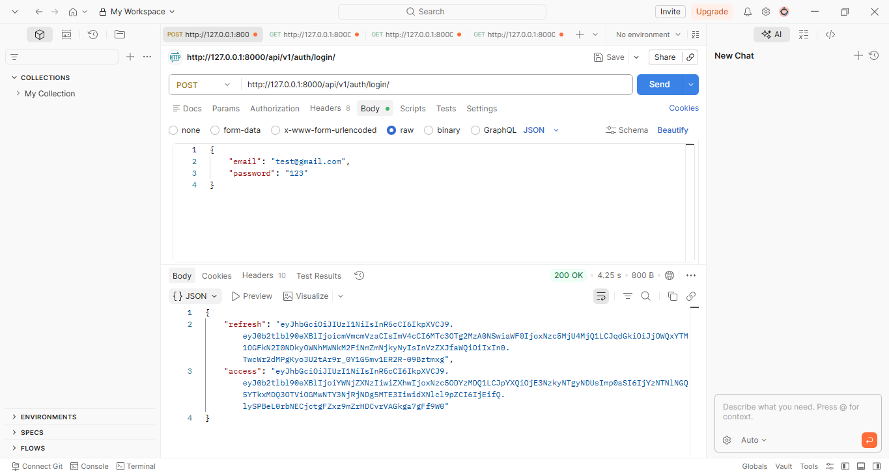
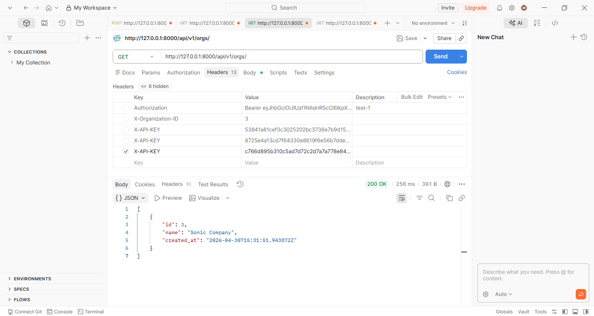
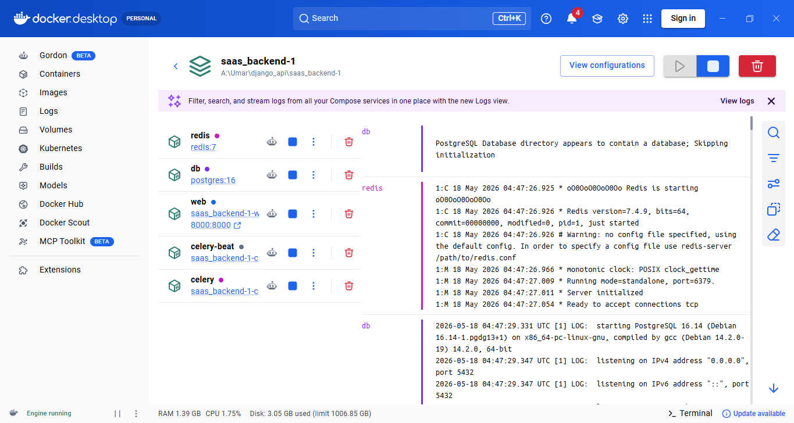
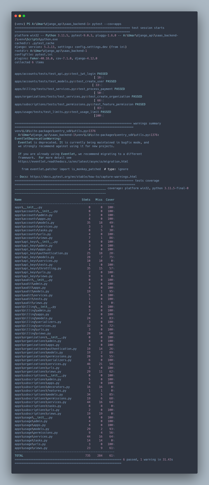

# Multi-Tenant SaaS API (DRF + Celery + Redis + API Keys) 🚀

> A production-grade multi-tenant SaaS backend built with **Django REST Framework** — designed for scalability, security, and real-world deployment.

---

## 🧠 Architecture Overview

```
Client
   ↓
Authentication Layer  (JWT / API Key)
   ↓
Permission Layer      (Organization-scoped RBAC)
   ↓
Service Layer         (Business logic isolation)
   ↓
PostgreSQL Database
   ↓
Redis Cache / Queue
   ↓
Celery Workers & Celery Beat
```

---

## ⚙️ Tech Stack

| Category           | Technology                        |
|--------------------|-----------------------------------|
| Backend            | Django, Django REST Framework     |
| Database           | PostgreSQL                        |
| Cache / Queue      | Redis                             |
| Async Tasks        | Celery, Celery Beat               |
| Containerization   | Docker, Docker Compose            |
| Testing            | Pytest, Pytest-Cov, Factory Boy   |
| API Documentation  | drf-spectacular (Swagger UI)      |
| Authentication     | JWT, API Keys                     |

---

## 🔐 Core Features

### Authentication
- JWT Authentication
- API Key Authentication with secure hashing
- API key expiration support

### Multi-Tenancy
- Organization-based tenant isolation
- Membership roles: `admin` / `member`

### SaaS Infrastructure
- Subscription plans & billing simulation engine
- Feature gating & flag system
- Usage metering & request rate limiting

### Async & Infrastructure
- Redis caching layer
- Celery workers for background jobs
- Celery Beat for scheduled tasks
- Dockerized full-stack deployment

### Observability
- Structured logging
- Audit log trail
- Activity tracking per organization

---

## 📂 Project Structure

```
drf-saas-platform/
│
├── apps/
│   ├── accounts/
│   ├── api_keys/
│   ├── audit/
│   ├── billing/
│   ├── organizations/
│   ├── subscriptions/
│   └── usage/
│
├── config/
│   ├── settings/
│   ├── celery.py
│   ├── urls.py
│   └── utils/
│
├── tests/
│
├── Dockerfile
├── docker-compose.yml
├── requirements.txt
├── manage.py
└── pytest.ini
```

---

## 🚀 Local Development Setup

### 1. Clone the Repository

```bash
git clone <repository-url>
cd drf-saas-platform
```

### 2. Create Environment File

Copy the example file and configure your environment:

```bash
cp .env.example .env
```

`.env` example:

```env
SECRET_KEY=your-secret-key
DEBUG=True

DB_NAME=saas_db
DB_USER=postgres
DB_PASSWORD=postgres
DB_HOST=db
DB_PORT=5432

REDIS_URL=redis://redis:6379/0
```

### 3. Start Docker Services

```bash
docker compose up --build
```

### 4. Run Migrations

```bash
docker compose exec web python manage.py migrate
```

### 5. Create Superuser

```bash
docker compose exec web python manage.py createsuperuser
```

---

## 📡 API Documentation

Interactive Swagger UI available at:

```
http://localhost:8000/api/docs/
```

---

## 🧪 Testing

Run the full test suite:

```bash
pytest
```

Run with coverage report:

```bash
pytest --cov=apps
```

---

## 🐳 Docker Services

| Service        | Description              |
|----------------|--------------------------|
| `web`          | Django application       |
| `db`           | PostgreSQL database      |
| `redis`        | Redis cache & queue      |
| `worker`       | Celery worker            |
| `beat`         | Celery Beat scheduler    |

Start all services:

```bash
docker compose up
```

Stop all services:

```bash
docker compose down
```

---

## ⚡ SaaS Concepts Implemented

- Multi-tenant architecture with tenant isolation
- API key authentication system with hashing
- Subscription lifecycle management
- Feature flag / feature gate system
- Usage tracking & metering per tenant
- Organization-based permission model
- Async background task processing
- Scheduled task automation
- Audit logging system
- Structured observability

---

## 🔒 Security Features

- Hashed API keys (never stored in plaintext)
- Environment-based secrets management
- Organization-level access control
- JWT-based stateless authentication
- Request throttling per tenant
- Full audit trail system

---

---

# 📸 Project Screenshots

## Swagger API Documentation


---

## JWT Authentication



---

## API Key Authentication



---

## Docker Infrastructure



---


## Test Coverage



---


## 👨‍💻 Author

**Umar Farooq** — Backend Developer (Django / DRF)

Focused on:
- SaaS backend systems
- API architecture & design
- Distributed backend infrastructure
- Scalable Django applications

---

> ⭐ If you find this project useful, consider giving it a star!
